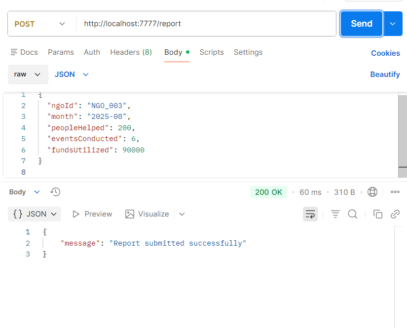
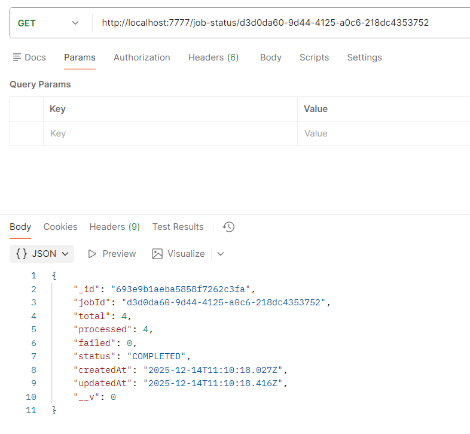
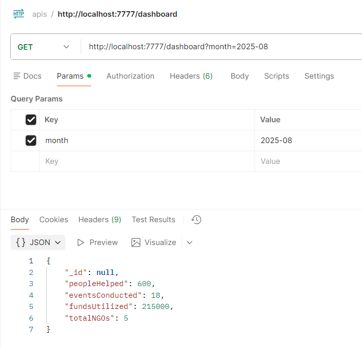

# 📘 NGO Impact Reporting System - Backend

Scalable Node.js backend API for NGO monthly impact report management with asynchronous CSV processing, MongoDB storage, and real-time job tracking.

Designed with idempotent writes, partial failure handling, and async processing for scale and reliability.

## 🚀 Backend Features

- **Single Report API** - Submit individual monthly reports
- **Bulk CSV Upload** - Asynchronous file processing with job tracking
- **Dashboard Aggregation** - Monthly metrics calculation
- **Job Status Tracking** - Real-time progress monitoring
- **Idempotent Operations** - Prevent duplicate reports
- **Partial Failure Handling** - Process valid rows, track failed ones

## 🧱 Tech Stack

- **Node.js** - Runtime environment
- **Express.js** - Web framework
- **MongoDB** - Document database
- **Mongoose** - ODM for MongoDB
- **Multer** - File upload middleware
- **CSV Parser** - CSV processing
- **UUID** - Unique job identifiers
- **CORS** - Cross-origin resource sharing

## 🏗️ Backend Architecture

```
API Endpoints
 ├─ POST /report              # Single report submission
 ├─ POST /reports/upload      # CSV file upload
 ├─ GET /job-status/:jobId    # Job progress tracking
 └─ GET /dashboard            # Aggregated metrics
        |
        v
Express.js Server
 ├─ Routes (report, upload, dashboard, job)
 ├─ Middleware (CORS, JSON parser, Multer)
 ├─ Async CSV Processing
 └─ MongoDB Connection
        |
        v
MongoDB Collections
 ├─ reports (ngoId + month unique index)
 └─ jobs (processing status tracking)
```

## 🔑 Key Design Decisions

### 1. Idempotency
Reports are uniquely identified by `(ngoId + month)` using a compound unique index to prevent duplicate reporting.

### 2. Asynchronous CSV Processing
CSV uploads return immediately with a `jobId`. Processing happens in the background to avoid blocking API requests.

### 3. Partial Failure Handling
Invalid CSV rows do not stop processing. Valid rows are stored, and failed rows are counted.

### 4. Scalability Ready
The current design can be extended with:
- Job queues (BullMQ / Redis)
- Worker processes
- Retry logic for failed rows

## 📡 API Endpoints

### Submit Single Report
```http
POST /report
Content-Type: application/json

{
  "ngoId": "NGO_001",
  "month": "2025-08",
  "peopleHelped": 120,
  "eventsConducted": 4,
  "fundsUtilized": 50000
}
```
- 

### Upload CSV (Async)
```http
POST /reports/upload
Content-Type: multipart/form-data

file: [CSV file]
```
- 

### Get Job Status
```http
GET /job-status/:jobId
```
- 

### Dashboard Aggregation
```http
GET /dashboard?month=YYYY-MM
```
- 

## 📄 CSV Format

```csv
ngoId,month,peopleHelped,eventsConducted,fundsUtilized
NGO_001,2025-08,120,4,50000
NGO_002,2025-08,80,2,20000
```

## 🛠️ Local Setup Instructions

### 1️⃣ Clone Repository
```bash
git clone <repo-url>
cd wedogood-assigment/backend
```

### 2️⃣ Backend Setup
```bash
npm install
```

Create `.env` file:
```env
PORT=7777
MONGO_URI=<your-mongodb-uri>
```

Create uploads folder:
```bash
mkdir uploads
```

Start backend:
```bash
node src/app.js
```

Backend runs at: `http://localhost:7777`


## 📮 Postman Collection

Import the Postman collection from `postman/collections/apis.postman_collection.json` to test all API endpoints.

### Available Endpoints in Collection:
- **POST** `/report` - Submit single report
- **POST** `/reports/upload` - Upload CSV file
- **GET** `/job-status/:jobId` - Check processing status
- **GET** `/dashboard?month=YYYY-MM` - View aggregated metrics

## 📁 Project Structure

```
backend/
├── src/
│   ├── config/
│   │   └── database.js          # MongoDB connection
│   ├── models/
│   │   ├── Job.js              # Job tracking schema
│   │   └── Report.js           # Report schema
│   ├── routes/
│   │   ├── dashboard.js        # Dashboard aggregation
│   │   ├── job.js             # Job status tracking
│   │   ├── report.js          # Single report submission
│   │   └── upload.js          # CSV upload handling
│   ├── jobs/
│   │   └── processCsv.js      # Async CSV processing
│   └── app.js                 # Express server setup
├── postman/
│   └── collections/
│       └── apis.postman_collection.json
├── uploads/                   # CSV file storage
├── .env                      # Environment variables
├── package.json
└── README.md
```

## 🔧 Environment Variables

```env
PORT=7777                     # Server port
MONGO_URI=mongodb://...       # MongoDB connection string
```

## 🚦 Getting Started

1. Ensure MongoDB is running (local or Atlas)
2. Install dependencies: `npm install`
3. Create `.env` file with required variables
4. Create `uploads` directory: `mkdir uploads`
5. Start server: `node src/app.js`
6. Import Postman collection for API testing
6. Test APIs using Postman collection

## 📊 Database Schema

### Reports Collection
```javascript
{
  ngoId: String,
  month: String,           // Format: YYYY-MM
  peopleHelped: Number,
  eventsConducted: Number,
  fundsUtilized: Number,
  createdAt: Date
}
// Unique index: { ngoId: 1, month: 1 }
```

### Jobs Collection
```javascript
{
  jobId: String,
  status: String,          // 'processing', 'completed', 'failed'
  totalRows: Number,
  processedRows: Number,
  failedRows: Number,
  createdAt: Date,
  completedAt: Date
}
```

## 🎯 Future Enhancements

- Redis-based job queues
- Email notifications for job completion
- Data validation improvements
- Rate limiting
- Authentication & authorization
- Audit logging
- Export functionality
- Real-time dashboard updates